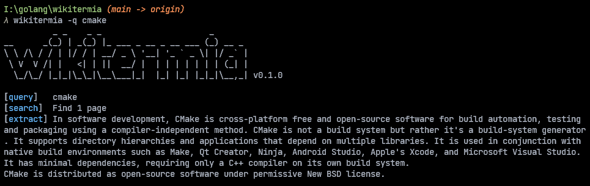

# 📚 Wikitermia
Unoffical Wikipedia terminal client written in Go


## 🔨 Building
For building just enter one line:
```bash
go build
```

## 🔩 Usage
```bash
./wikitermia -q cmake
```

## ⚙️ Options
### `-q` (required)
Set query

### `-l`
Set language (default: en)

### `-limit`
Set search limit (default: 1)

### `-v`
Display version
